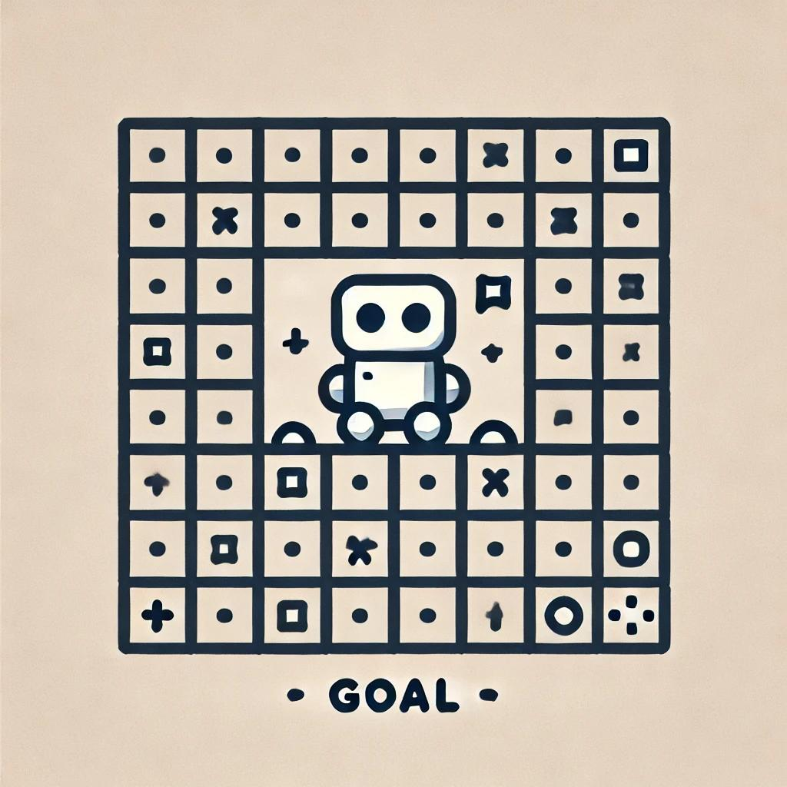

# Robot-s-Journey

1. [Kirish](#Kirish)
2. [Loyihaning maqsadi](#Loyihaning-maqsadi)
3. [Funktsional talablar](#Funktsional-talablar)
4. [Nefunktsional talablar](#Nefunktsional-talablar)
5. [Texnologik talablar](#Texnologik-talablar)
6. [Ishlab chiqish bo'yicha tavsiyalar](#Ishlab-chiqish-bo'yicha-tavsiyalar)
7. [Testlash](#Testlash)
8. [Hujjatlar](#Hujjatlar) 
9. [Xulosa](#Xulosa) 

## Robot - Journey 
Game - Photo

## Kirish

Ushbu texnik topshiriq junior dasturchiga mo'ljallangan va C tilida oddiy konsol o'yinini yaratish uchun talablarni tavsiflaydi.

## Loyihaning maqsadi

20x20 o'lchamdagi maydonda tasodifiy ravishda personaj (robot) joylashtirilgan konsol o'yinini yaratish, va o'yinchi uni o'q tugmalari yordamida maydon bo'ylab harakatlantira oladi.

## Funktsional talablar

3.1. O'yin maydoni

- Maydon 20x20 o'lchamdagi ikki o'lchovli massivdan iborat.
- Maydonning har bir hujayrasi konsol ekranida ko'rsatiladi.
- Bo'sh hujayralar bo'sh joy yoki nuqta belgisi bilan ifodalanishi mumkin.

3.2. Personajni joylashtirish

- O'yin ishga tushirilganda personaj (robot) maydonning biror hujayrasida tasodifiy ravishda joylashtirilishi kerak.
- Robot maydonda maxsus belgi bilan ko'rsatiladi, masalan, 'R' yoki '@'.

3.3. Personajni harakatlantirish

- O'yinchi robotni o'q tugmalari yordamida maydon bo'ylab harakatlantira oladi:
  - Yuqoriga
  - Pastga
  - Chapga
  - O'ngga
- Robot maydon chegaralaridan chiqib keta olmaydi. Chegaradan chiqishga urinishda robotning pozitsiyasi o'zgarmay qoladi.

3.4. Ko'rsatishni yangilash

- Robot har bir harakatidan so'ng maydon yangilanib, robotning yangi pozitsiyasi ekranda ko'rsatiladi.
- Yangi ko'rsatishdan oldin maydonning oldingi holati tozalanadi.

3.5. O'yinni yakunlash

- O'yin foydalanuvchi dasturdan qo'lda chiqmaguncha (masalan, Ctrl+C tugmalari yordamida) yoki chiqish uchun qo'shimcha buyruq amalga oshirilmaguncha (masalan, 'q' tugmasi) davom etadi.

## Nefunktsional talablar

4.1. Foydalanuvchi interfeysi

- Ilova konsolda (CLI) grafikalik interfeysiz ishlaydi.
- Buyruqlarni kiritishda har bir o'q tugmasidan keyin Enter tugmasini bosish shart emas.

4.2. Ishlash unumdorligi

- O'yin foydalanuvchi kiritishiga sezilarli kechikishlarsiz javob berishi kerak.

4.3. Kod sifati

- Kod toza va o'qilishi oson bo'lishi, o'zgaruvchilar va funksiyalarning tushunarli nomlari bo'lishi kerak.
- Kodning murakkab qismlarini tushuntirish uchun izohlar qo'shilishi kerak.

## Texnologik talablar

5.1. Dasturlash tili

- C (ANSI C89/C90 yoki undan yuqori).

5.2. Kutubxonalar

- C tilining standart kutubxonasidan foydalanishga ruxsat etiladi.
- Enter tugmasini kutmasdan kiritishni qayta ishlash uchun ncurses yoki shunga o'xshash kutubxonalardan foydalanish mumkin.

5.3. Platforma

- Ilova Linux yoki Windows operatsion tizimlarida kompilyatsiya qilinib, ishga tushirilishi kerak.

## Ishlab chiqish bo'yicha tavsiyalar
6.1.
- Dastur tuzilishini yaxshilash uchun kodni funksiyalarga bo'ling (masalan, maydonni initsializatsiya qilish, maydonni ko'rsatish, kiritishni qayta ishlash va hokazo).

6.2.
- Mumkin bo'lgan xatolarni qayta ishlang (masalan, xotira ajratish muvaffaqiyatini tekshirish, kiritishning to'g'riligini tekshirish va hokazo).

## Testlash

- O'yin boshlanganda robotning tasodifiy joylashtirilganligini tekshiring.
- Robotning maydon bo'ylab to'g'ri harakatlanishi va chegaradan chiqmasligini ta'minlang.
- Tez va ketma-ket tugmalarni bosishga dastur qanday javob berishini tekshiring.
- Xotira oqishlari va nosozliklarni test qiling.

## Hujjatlar

- README faylida o'yinni ishga tushirish va boshqarish bo'yicha qisqa qo'llanma taqdim eting.
- Foydalanilgan kutubxonalar va ularni o'rnatish bo'yicha ko'rsatmalarni tasvirlab bering (agar qo'llanilgan bo'lsa).

## Xulosa

Ushbu texnik topshiriq C tilidagi oddiy CLI o'yinini tavsiflaydi, dasturlash ko'nikmalarini amalda qo'llash va rivojlantirish uchun mo'ljallangan.